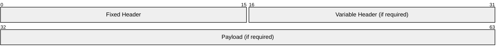

# 2.1 Structure of an MQTT Control Packet

The MQTT protocol works by exchanging a series of MQTT Control Packets in a defined way. This section describes the format of these packets.

An MQTT Control Packet consists of up to three parts, always in the following order as illustrated in [Figure 2.1 - Structure of an MQTT Control Packet](#_Figure_2.1_-).

##### Figure 2.1 – Structure of an MQTT Control Packet

