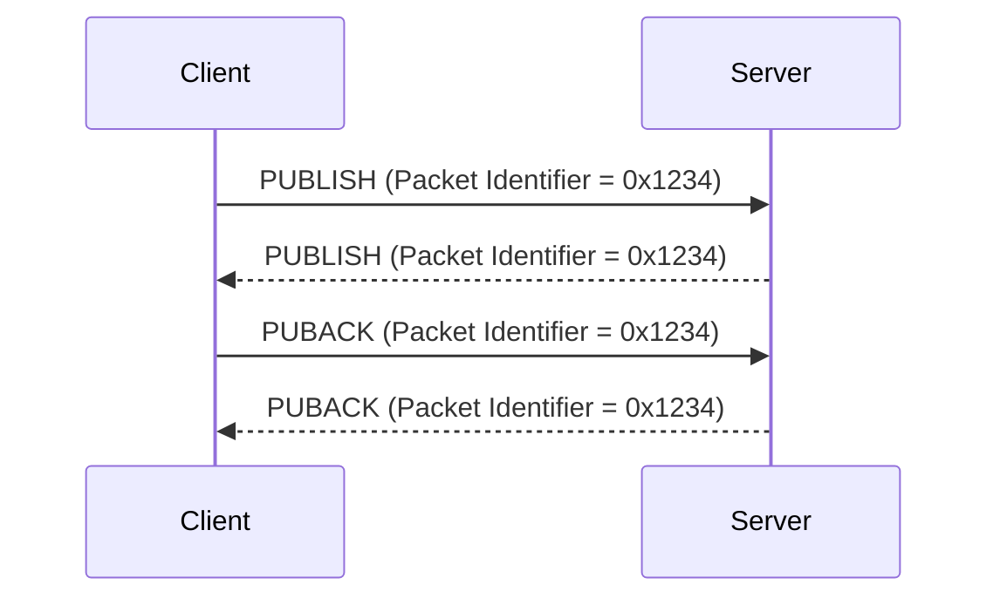

# 2.3 Variable header

Some types of MQTT Control Packets contain a variable header component. It resides between the fixed header and the payload. The content of the variable header varies depending on the Packet type. The Packet Identifier field of variable header is common in several packet types.

## 2.3.1 Packet Identifier

##### Figure 2.3 - Packet Identifier bytes

The variable header component of many of the Control Packet types includes a 2 byte Packet Identifier field. These Control Packets are PUBLISH (where QoS > 0), PUBACK, PUBREC, PUBREL, PUBCOMP, SUBSCRIBE, SUBACK, UNSUBSCRIBE, UNSUBACK.

SUBSCRIBE, UNSUBSCRIBE, and PUBLISH (in cases where QoS > 0) Control Packets MUST contain a non-zero 16-bit Packet Identifier \[MQTT-2.3.1-1\]. Each time a Client sends a new packet of one of these types it MUST assign it a currently unused Packet Identifier \[MQTT-2.3.1-2\]. If a Client re-sends a particular Control Packet, then it MUST use the same Packet Identifier in subsequent re-sends of that packet. The Packet Identifier becomes available for reuse after the Client has processed the corresponding acknowledgement packet. In the case of a QoS 1 PUBLISH this is the corresponding PUBACK; in the case of QoS 2 it is PUBCOMP. For SUBSCRIBE or UNSUBSCRIBE it is the corresponding SUBACK or UNSUBACK \[MQTT-2.3.1-3\]. The same conditions apply to a Server when it sends a PUBLISH with QoS > 0 \[MQTT-2.3.1-4\].

A PUBLISH Packet MUST NOT contain a Packet Identifier if its QoS value is set to 0 \[MQTT-2.3.1-5\].

A PUBACK, PUBREC or PUBREL Packet MUST contain the same Packet Identifier as the PUBLISH Packet that was originally sent \[MQTT-2.3.1-6\]. Similarly SUBACK and UNSUBACK MUST contain the Packet Identifier that was used in the corresponding SUBSCRIBE and UNSUBSCRIBE Packet respectively \[MQTT-2.3.1-7\].

Control Packets that require a Packet Identifier are listed in [Table 2.5 - Control Packets that contain a Packet Identifier](#_Table_2.5_-).

##### Table 2.5 - Control Packets that contain a Packet Identifier

| **Control Packet** | **Packet Identifier field** |
| ------------------ | --------------------------- |
| CONNECT            | NO                          |
| CONNACK            | NO                          |
| PUBLISH            | YES (If QoS > 0)            |
| PUBACK             | YES                         |
| PUBREC             | YES                         |
| PUBREL             | YES                         |
| PUBCOMP            | YES                         |
| SUBSCRIBE          | YES                         |
| SUBACK             | YES                         |
| UNSUBSCRIBE        | YES                         |
| UNSUBACK           | YES                         |
| PINGREQ            | NO                          |
| PINGRESP           | NO                          |
| DISCONNECT         | NO                          |

The Client and Server assign Packet Identifiers independently of each other. As a result, Client Server pairs can participate in concurrent message exchanges using the same Packet Identifiers.

**Non normative comment**

It is possible for a Client to send a PUBLISH Packet with Packet Identifier 0x1234 and then receive a different PUBLISH with Packet Identifier 0x1234 from its Server before it receives a PUBACK for the PUBLISH that it sent.

