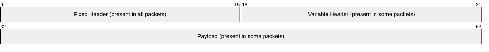
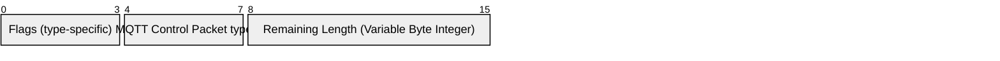

# 2.1 Structure of an MQTT Control Packet

The MQTT protocol operates by exchanging a series of MQTT Control Packets in a defined way. This section describes the format of these packets.

An MQTT Control Packet consists of up to three parts, always in the following order:

##### Figure 2-1 Structure of an MQTT Control Packet

## 2.1.1 Fixed Header

Each MQTT Control Packet contains a Fixed Header as shown below.

##### Figure 2-2 Fixed Header format

## 2.1.2 MQTT Control Packet type

**Position:** byte 1, bits 7-4.

Represented as a 4-bit unsigned value, the values are shown below.

##### Table 2-1 MQTT Control Packet types

| **Name**    | **Value** | **Direction of flow**              | **Description**                          |
| ----------- | --------- | ---------------------------------- | ---------------------------------------- |
| Reserved    | 0         | Forbidden                          | Reserved                                 |
| CONNECT     | 1         | Client to Server                   | Connection request                       |
| CONNACK     | 2         | Server to Client                   | Connect acknowledgment                   |
| PUBLISH     | 3         | Client to Server or Server to Client | Publish message                        |
| PUBACK      | 4         | Client to Server or Server to Client | Publish acknowledgment (QoS 1)         |
| PUBREC      | 5         | Client to Server or Server to Client | Publish received (QoS 2 delivery part 1) |
| PUBREL      | 6         | Client to Server or Server to Client | Publish release (QoS 2 delivery part 2) |
| PUBCOMP     | 7         | Client to Server or Server to Client | Publish complete (QoS 2 delivery part 3) |
| SUBSCRIBE   | 8         | Client to Server                   | Subscribe request                        |
| SUBACK      | 9         | Server to Client                   | Subscribe acknowledgment                 |
| UNSUBSCRIBE | 10        | Client to Server                   | Unsubscribe request                      |
| UNSUBACK    | 11        | Server to Client                   | Unsubscribe acknowledgment               |
| PINGREQ     | 12        | Client to Server                   | PING request                             |
| PINGRESP    | 13        | Server to Client                   | PING response                            |
| DISCONNECT  | 14        | Client to Server or Server to Client | Disconnect notification                |
| AUTH        | 15        | Client to Server or Server to Client | Authentication exchange                |

## 2.1.3 Flags

The remaining bits \[3-0\] of byte 1 in the Fixed Header contain flags specific to each MQTT Control Packet type as shown below. Where a flag bit is marked as `Reserved`, it is reserved for future use and MUST be set to the value listed \[MQTT-2.1.3-1\]. If invalid flags are received it is a Malformed Packet. Refer to [section 4.13](4.13_handling-errors.md) for details about handling errors.

##### Table 2-2 Flag Bits

| **MQTT Control Packet** | **Fixed Header flags** | **Bit 3** | **Bit 2** | **Bit 1** | **Bit 0** |
| ----------------------- | ---------------------- | --------- | --------- | --------- | --------- |
| CONNECT                 | Reserved               | 0         | 0         | 0         | 0         |
| CONNACK                 | Reserved               | 0         | 0         | 0         | 0         |
| PUBLISH                 | Used in MQTT v5.0      | DUP       | QoS       |           | RETAIN    |
| PUBACK                  | Reserved               | 0         | 0         | 0         | 0         |
| PUBREC                  | Reserved               | 0         | 0         | 0         | 0         |
| PUBREL                  | Reserved               | 0         | 0         | 1         | 0         |
| PUBCOMP                 | Reserved               | 0         | 0         | 0         | 0         |
| SUBSCRIBE               | Reserved               | 0         | 0         | 1         | 0         |
| SUBACK                  | Reserved               | 0         | 0         | 0         | 0         |
| UNSUBSCRIBE             | Reserved               | 0         | 0         | 1         | 0         |
| UNSUBACK                | Reserved               | 0         | 0         | 0         | 0         |
| PINGREQ                 | Reserved               | 0         | 0         | 0         | 0         |
| PINGRESP                | Reserved               | 0         | 0         | 0         | 0         |
| DISCONNECT              | Reserved               | 0         | 0         | 0         | 0         |
| AUTH                    | Reserved               | 0         | 0         | 0         | 0         |

- DUP = Duplicate delivery of a PUBLISH packet
- QoS = PUBLISH Quality of Service
- RETAIN = PUBLISH retained message flag

Refer to [section 3.3.1](3.3_publish.md#331-fixed-header) for a description of the DUP, QoS, and RETAIN flags in the PUBLISH packet.

## 2.1.4 Remaining Length

**Position:** starts at byte 2.

The Remaining Length is a Variable Byte Integer that represents the number of bytes remaining within the current Control Packet, including data in the Variable Header and the Payload. The Remaining Length does not include the bytes used to encode the Remaining Length. The packet size is the total number of bytes in an MQTT Control Packet, this is equal to the length of the Fixed Header plus the Remaining Length.
