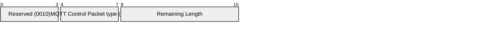

# 3.10 UNSUBSCRIBE – Unsubscribe request

An UNSUBSCRIBE packet is sent by the Client to the Server, to unsubscribe from topics.

## 3.10.1 UNSUBSCRIBE Fixed Header

Figure 3.28 – UNSUBSCRIBE packet Fixed Header

| **Bit** | **7** | **6** | **5** | **4** | **3** | **2** | **1** | **0** |
| ------- | ----- | ----- | ----- | ----- | ----- | ----- | ----- | ----- |
| byte 1  | **MQTT Control Packet type (10)** |       |       |       | **Reserved** |       |       |       |
|         | 1     | 0     | 1     | 0     | 0     | 0     | 1     | 0     |
| byte 2  | **Remaining Length** |       |       |       |       |       |       |       |

Bits 3,2,1 and 0 of the Fixed Header of the UNSUBSCRIBE packet are reserved and MUST be set to 0,0,1 and 0 respectively. The Server MUST treat any other value as malformed and close the Network Connection [MQTT-3.10.1-1].

**Remaining Length field**

This is the length of Variable Header (2 bytes) plus the length of the Payload, encoded as a Variable Byte Integer.

## 3.10.2 UNSUBSCRIBE Variable Header

The Variable Header of the UNSUBSCRIBE Packet contains the following fields in the order: Packet Identifier, and Properties. [Section 2.2.1](2-mqtt-control-packets.md#221-packet-identifier) provides more information about Packet Identifiers. The rules for encoding Properties are described in [section 2.2.2](2-mqtt-control-packets.md#222-properties).

### 3.10.2.1 UNSUBSCRIBE Properties

#### 3.10.2.1.1 Property Length

The length of Properties in the UNSUBSCRIBE packet Variable Header encoded as a Variable Byte Integer.

#### 3.10.2.1.2 User Property

**38 (0x26) Byte**, Identifier of the User Property.

Followed by a UTF-8 String Pair.

The User Property is allowed to appear multiple times to represent multiple name, value pairs. The same name is allowed to appear more than once.

**Non-normative comment**

User Properties on the UNSUBSCRIBE packet can be used to send subscription related properties from the Client to the Server. The meaning of these properties is not defined by this specification.

## 3.10.3 UNSUBSCRIBE Payload

The Payload for the UNSUBSCRIBE packet contains the list of Topic Filters that the Client wishes to unsubscribe from. The Topic Filters in an UNSUBSCRIBE packet MUST be UTF-8 Encoded Strings [MQTT-3.10.3-1] as defined in [section 1.5.4](1-introduction.md#154-utf-8-encoded-string), packed contiguously.

The Payload of an UNSUBSCRIBE packet MUST contain at least one Topic Filter [MQTT-3.10.3-2]. An UNSUBSCRIBE packet with no Payload is a Protocol Error. Refer to [section 4.13](4-operational-behavior.md#413-handling-errors) for information about handling errors.

**Non-normative example**

Figure 3.30 shows the Payload for an UNSUBSCRIBE packet with two Topic Filters `a/b` and `c/d`.

Figure 3.30 - Payload byte format non-normative example

| | **Description** | **7** | **6** | **5** | **4** | **3** | **2** | **1** | **0** |
| ------------ | --------------- | ----- | ----- | ----- | ----- | ----- | ----- | ----- | ----- |
| **Topic Filter** |                 |       |       |       |       |       |       |       |       |
| byte 1       | Length MSB (0)  | 0     | 0     | 0     | 0     | 0     | 0     | 0     | 0     |
| byte 2       | Length LSB (3)  | 0     | 0     | 0     | 0     | 0     | 0     | 1     | 1     |
| byte 3       | `a` (0x61)      | 0     | 1     | 1     | 0     | 0     | 0     | 0     | 1     |
| byte 4       | `/` (0x2F)      | 0     | 0     | 1     | 0     | 1     | 1     | 1     | 1     |
| byte 5       | `b` (0x62)      | 0     | 1     | 1     | 0     | 0     | 0     | 1     | 0     |
| **Topic Filter** |                 |       |       |       |       |       |       |       |       |
| byte 6       | Length MSB (0)  | 0     | 0     | 0     | 0     | 0     | 0     | 0     | 0     |
| byte 7       | Length LSB (3)  | 0     | 0     | 0     | 0     | 0     | 0     | 1     | 1     |
| byte 8       | `c` (0x63)      | 0     | 1     | 1     | 0     | 0     | 0     | 1     | 1     |
| byte 9       | `/` (0x2F)      | 0     | 0     | 1     | 0     | 1     | 1     | 1     | 1     |
| byte 10      | `d` (0x64)      | 0     | 1     | 1     | 0     | 0     | 1     | 0     | 0     |

## 3.10.4 UNSUBSCRIBE Actions

The Topic Filters (whether they contain wildcards or not) supplied in an UNSUBSCRIBE packet MUST be compared character-by-character with the current set of Topic Filters held by the Server for the Client. If any filter matches exactly then its owning Subscription MUST be deleted [MQTT-3.10.4-1], otherwise no additional processing occurs.

When a Server receives UNSUBSCRIBE :

- It MUST stop adding any new messages which match the Topic Filters, for delivery to the Client [MQTT-3.10.4-2].
- It MUST complete the delivery of any QoS 1 or QoS 2 messages which match the Topic Filters and it has started to send to the Client [MQTT-3.10.4-3].
- It MAY continue to deliver any existing messages buffered for delivery to the Client.

The Server MUST respond to an UNSUBSCRIBE request by sending an UNSUBACK packet [MQTT-3.10.4-4]. The UNSUBACK packet MUST have the same Packet Identifier as the UNSUBSCRIBE packet. Even where no Topic Subscriptions are deleted, the Server MUST respond with an UNSUBACK [MQTT-3.10.4-5].

If a Server receives an UNSUBSCRIBE packet that contains multiple Topic Filters, it MUST process that packet as if it had received a sequence of multiple UNSUBSCRIBE packets, except that it sends just one UNSUBACK response [MQTT-3.10.4-6].

If a Topic Filter represents a Shared Subscription, this Session is detached from the Shared Subscription. If this Session was the only Session that the Shared Subscription was associated with, the Shared Subscription is deleted. Refer to [section 4.8.2](4-operational-behavior.md#482-shared-subscriptions) for a description of Shared Subscription handling.
