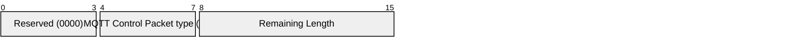

# 3.11 UNSUBACK – Unsubscribe acknowledgement

The UNSUBACK packet is sent by the Server to the Client to confirm receipt of an UNSUBSCRIBE packet.

## 3.11.1 UNSUBACK Fixed Header

Figure 3.31 – UNSUBACK packet Fixed Header

| **Bit** | **7** | **6** | **5** | **4** | **3** | **2** | **1** | **0** |
| ------- | ----- | ----- | ----- | ----- | ----- | ----- | ----- | ----- |
| byte 1  | **MQTT Control Packet type (11)** |       |       |       | **Reserved** |       |       |       |
|         | 1     | 0     | 1     | 1     | 0     | 0     | 0     | 0     |
| byte 2  | **Remaining Length** |       |       |       |       |       |       |       |

**Remaining Length field**

This is the length of the Variable Header plus the length of the Payload, encoded as a Variable Byte Integer.

## 3.11.2 UNSUBACK Variable Header

The Variable Header of the UNSUBACK Packet the following fields in the order: the Packet Identifier from the UNSUBSCRIBE Packet that is being acknowledged, and Properties. The rules for encoding Properties are described in [section 2.2.2](2-mqtt-control-packets.md#222-properties).

Figure 3.32 – UNSUBACK packet Variable Header

| **Bit** | **7** | **6** | **5** | **4** | **3** | **2** | **1** | **0** |
| ------- | --------------------- | ----- | ----- | ----- | ----- | ----- | ----- | ----- |
| byte 1  | Packet Identifier MSB |       |       |       |       |       |       |       |
| byte 2  | Packet Identifier LSB |       |       |       |       |       |       |       |

### 3.11.2.1 UNSUBACK Properties

#### 3.11.2.1.1 Property Length

The length of the Properties in the UNSUBACK packet Variable Header encoded as a Variable Byte Integer.

#### 3.11.2.1.2 Reason String

**31 (0x1F) Byte,** Identifier of the Reason String.

Followed by the UTF-8 Encoded String representing the reason associated with this response. This Reason String is a human readable string designed for diagnostics and SHOULD NOT be parsed by the Client.

The Server uses this value to give additional information to the Client. The Server MUST NOT send this Property if it would increase the size of the UNSUBACK packet beyond the Maximum Packet Size specified by the Client [MQTT-3.11.2-1]. It is a Protocol Error to include the Reason String more than once.

#### 3.11.2.1.3 User Property

**38 (0x26) Byte,** Identifier of the User Property.

Followed by UTF-8 String Pair. This property can be used to provide additional diagnostic or other information. The Server MUST NOT send this property if it would increase the size of the UNSUBACK packet beyond the Maximum Packet Size specified by the Client [MQTT-3.11.2-2]. The User Property is allowed to appear multiple times to represent multiple name, value pairs. The same name is allowed to appear more than once.

## 3.11.3 UNSUBACK Payload

The Payload contains a list of Reason Codes. Each Reason Code corresponds to a Topic Filter in the UNSUBSCRIBE packet being acknowledged. The order of Reason Codes in the UNSUBACK packet MUST match the order of Topic Filters in the UNSUBSCRIBE packet [MQTT-3.11.3-1].

The values for the one byte unsigned Unsubscribe Reason Codes are shown below. The Server sending an UNSUBACK packet MUST use one of the Unsubscribe Reason Code values for each Topic Filter received [MQTT-3.11.3-2].

Table 3-9 - Unsubscribe Reason Codes

| **Value** | **Hex** | **Reason Code name**          | **Description**                                                                                                                          |
| --------- | ------- | ----------------------------- | ---------------------------------------------------------------------------------------------------------------------------------------- |
| 0         | 0x00    | Success                       | The subscription is deleted.                                                                                                             |
| 17        | 0x11    | No subscription existed       | No matching Topic Filter is being used by the Client.                                                                                    |
| 128       | 0x80    | Unspecified error             | The unsubscribe could not be completed and the Server either does not wish to reveal the reason or none of the other Reason Codes apply. |
| 131       | 0x83    | Implementation specific error | The UNSUBSCRIBE is valid but the Server does not accept it.                                                                              |
| 135       | 0x87    | Not authorized                | The Client is not authorized to unsubscribe.                                                                                             |
| 143       | 0x8F    | Topic Filter invalid          | The Topic Filter is correctly formed but is not allowed for this Client.                                                                 |
| 145       | 0x91    | Packet Identifier in use      | The specified Packet Identifier is already in use.                                                                                       |

**Non-normative comment**

There is always one Reason Code for each Topic Filter in the corresponding UNSUBSCRIBE packet. If the Reason Code is not specific to a Topic Filters (such as 0x91 (Packet Identifier in use)) it is set for each Topic Filter.
