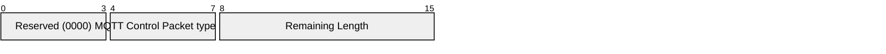
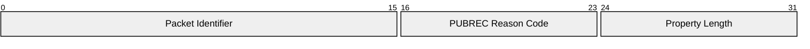

# 3.5 PUBREC – Publish received (QoS 2 delivery part 1)

A PUBREC packet is the response to a PUBLISH packet with QoS 2. It is the second packet of the QoS 2 protocol exchange.

## 3.5.1 PUBREC Fixed Header

Figure 3-12 - PUBREC packet Fixed Header

|         |                              |       |       |       |          |       |       |       |
| ------- | ---------------------------- | ----- | ----- | ----- | -------- | ----- | ----- | ----- |
| **Bit** | **7**                        | **6** | **5** | **4** | **3**    | **2** | **1** | **0** |
| byte 1  | MQTT Control Packet type (5) |       |       |       | Reserved |       |       |       |
|         | 0                            | 1     | 0     | 1     | 0        | 0     | 0     | 0     |
| byte 2  | Remaining Length             |       |       |       |          |       |       |       |

**Remaining Length field**

This is the length of the Variable Header, encoded as a Variable Byte Integer.

## 3.5.2 PUBREC Variable Header

The Variable Header of the PUBREC Packet consists of the following fields in the order: the Packet Identifier from the PUBLISH packet that is being acknowledged, PUBREC Reason Code, and Properties. The rules for encoding Properties are described in [section 2.2.2](./2.2_mqtt-control-packet-format.md#222-properties).

Figure 3-13 - PUBREC packet Variable Header

|         |                       |       |       |       |       |       |       |       |
| ------- | --------------------- | ----- | ----- | ----- | ----- | ----- | ----- | ----- |
| **Bit** | **7**                 | **6** | **5** | **4** | **3** | **2** | **1** | **0** |
| byte 1  | Packet Identifier MSB |       |       |       |       |       |       |       |
| byte 2  | Packet Identifier LSB |       |       |       |       |       |       |       |
| byte 3  | PUBREC Reason Code    |       |       |       |       |       |       |       |
| byte 4  | Property Length       |       |       |       |       |       |       |       |

### 3.5.2.1 PUBREC Reason Code

Byte 3 in the Variable Header is the PUBREC Reason Code. If the Remaining Length is 2, then the Publish Reason Code has the value 0x00 (Success).

Table 3-5 – PUBREC Reason Codes

|           |         |                               |                                                                                                                                                                                                           |
| --------- | ------- | ----------------------------- | --------------------------------------------------------------------------------------------------------------------------------------------------------------------------------------------------------- |
| **Value** | **Hex** | **Reason Code name**          | **Description**                                                                                                                                                                                           |
| 0         | 0x00    | Success                       | The message is accepted. Publication of the QoS 2 message proceeds.                                                                                                                                       |
| 16        | 0x10    | No matching subscribers.      | The message is accepted but there are no subscribers. This is sent only by the Server. If the Server knows that there are no matching subscribers, it MAY use this Reason Code instead of 0x00 (Success). |
| 128       | 0x80    | Unspecified error             | The receiver does not accept the publish but either does not want to reveal the reason, or it does not match one of the other values.                                                                     |
| 131       | 0x83    | Implementation specific error | The PUBLISH is valid but the receiver is not willing to accept it.                                                                                                                                        |
| 135       | 0x87    | Not authorized                | The PUBLISH is not authorized.                                                                                                                                                                            |
| 144       | 0x90    | Topic Name invalid            | The Topic Name is not malformed, but is not accepted by this Client or Server.                                                                                                                            |
| 145       | 0x91    | Packet Identifier in use      | The Packet Identifier is already in use. This might indicate a mismatch in the Session State between the Client and Server.                                                                               |
| 151       | 0x97    | Quota exceeded                | An implementation or administrative imposed limit has been exceeded.                                                                                                                                      |
| 153       | 0x99    | Payload format invalid        | The payload format does not match the one specified in the Payload Format Indicator.                                                                                                                      |

The Client or Server sending the PUBREC packet MUST use one of the PUBREC Reason Code values. [MQTT-3.5.2-1]. The Reason Code and Property Length can be omitted if the Reason Code is 0x00 (Success) and there are no Properties. In this case the PUBREC has a Remaining Length of 2.

### 3.5.2.2 PUBREC Properties

#### 3.5.2.2.1 Property Length

The length of the Properties in the PUBREC packet Variable Header encoded as a Variable Byte Integer. If the Remaining Length is less than 4 there is no Property Length and the value of 0 is used.

#### 3.5.2.2.2 Reason String

**31 (0x1F) Byte**, Identifier of the Reason String.

Followed by the UTF-8 Encoded String representing the reason associated with this response. This Reason String is human readable, designed for diagnostics and SHOULD NOT be parsed by the receiver.

The sender uses this value to give additional information to the receiver. The sender MUST NOT send this property if it would increase the size of the PUBREC packet beyond the Maximum Packet Size specified by the receiver [MQTT-3.5.2-2]. It is a Protocol Error to include the Reason String more than once.

#### 3.5.2.2.3 User Property

**38 (0x26) Byte,** Identifier of the User Property.

Followed by UTF-8 String Pair. This property can be used to provide additional diagnostic or other information. The sender MUST NOT send this property if it would increase the size of the PUBREC packet beyond the Maximum Packet Size specified by the receiver [MQTT-3.5.2-3]. The User Property is allowed to appear multiple times to represent multiple name, value pairs. The same name is allowed to appear more than once.

## 3.5.3 PUBREC Payload

The PUBREC packet has no Payload.

## 3.5.4 PUBREC Actions

This is described in [section 4.3.3](./4.3_quality-of-service-levels-and-protocol-flows.md#433-qos-2-exactly-once-delivery).
