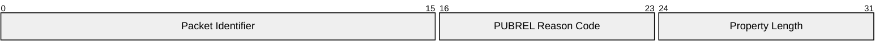

# 3.6 PUBREL – Publish release (QoS 2 delivery part 2)

A PUBREL packet is the response to a PUBREC packet. It is the third packet of the QoS 2 protocol exchange.

## 3.6.1 PUBREL Fixed Header

Figure 3-14 – PUBREL packet Fixed Header

|         |                              |       |       |       |          |       |       |       |
| ------- | ---------------------------- | ----- | ----- | ----- | -------- | ----- | ----- | ----- |
| **Bit** | **7**                        | **6** | **5** | **4** | **3**    | **2** | **1** | **0** |
| byte 1  | MQTT Control Packet type (6) |       |       |       | Reserved |       |       |       |
|         | 0                            | 1     | 1     | 0     | 0        | 0     | 1     | 0     |
| byte 2  | Remaining Length             |       |       |       |          |       |       |       |

Bits 3,2,1 and 0 of the Fixed Header in the PUBREL packet are reserved and MUST be set to 0,0,1 and 0 respectively. The Server MUST treat any other value as malformed and close the Network Connection [MQTT-3.6.1-1].

**Remaining Length field**

This is the length of the Variable Header, encoded as a Variable Byte Integer.

## 3.6.2 PUBREL Variable Header

The Variable Header of the PUBREL Packet contains the following fields in the order: the Packet Identifier from the PUBREC packet that is being acknowledged, PUBREL Reason Code, and Properties. The rules for encoding Properties are described in [section 2.2.2.](./2.2_mqtt-control-packet-format.md#222-properties)

Figure 3-15 – PUBREL packet Variable Header

|         |                       |       |       |       |       |       |       |       |
| ------- | --------------------- | ----- | ----- | ----- | ----- | ----- | ----- | ----- |
| **Bit** | **7**                 | **6** | **5** | **4** | **3** | **2** | **1** | **0** |
| byte 1  | Packet Identifier MSB |       |       |       |       |       |       |       |
| byte 2  | Packet Identifier LSB |       |       |       |       |       |       |       |
| byte 3  | PUBREL Reason Code    |       |       |       |       |       |       |       |
| byte 4  | Property Length       |       |       |       |       |       |       |       |

### 3.6.2.1 PUBREL Reason Code

Byte 3 in the Variable Header is the PUBREL Reason Code. If the Remaining Length is 2, the value of 0x00 (Success) is used.

Table 3-6 - PUBREL Reason Codes

|           |         |                             |                                                                                                                                                                       |
| --------- | ------- | --------------------------- | --------------------------------------------------------------------------------------------------------------------------------------------------------------------- |
| **Value** | **Hex** | **Reason Code name**        | **Description**                                                                                                                                                       |
| 0         | 0x00    | Success                     | Message released.                                                                                                                                                     |
| 146       | 0x92    | Packet Identifier not found | The Packet Identifier is not known. This is not an error during recovery, but at other times indicates a mismatch between the Session State on the Client and Server. |

The Client or Server sending the PUBREL packet MUST use one of the PUBREL Reason Code values [MQTT-3.6.2-1]. The Reason Code and Property Length can be omitted if the Reason Code is 0x00 (Success) and there are no Properties. In this case the PUBREL has a Remaining Length of 2.

### 3.6.2.2 PUBREL Properties

#### 3.6.2.2.1 Property Length

The length of the Properties in the PUBREL packet Variable Header encoded as a Variable Byte Integer. If the Remaining Length is less than 4 there is no Property Length and the value of 0 is used.

#### 3.6.2.2.2 Reason String

**31 (0x1F) Byte**, Identifier of the Reason String.

Followed by the UTF-8 Encoded String representing the reason associated with this response. This Reason String is human readable, designed for diagnostics and SHOULD NOT be parsed by the receiver.

The sender uses this value to give additional information to the receiver. The sender MUST NOT send this Property if it would increase the size of the PUBREL packet beyond the Maximum Packet Size specified by the receiver [MQTT-3.6.2-2]. It is a Protocol Error to include the Reason String more than once.

#### 3.6.2.2.3 User Property

**38 (0x26) Byte,** Identifier of the User Property.

Followed by UTF-8 String Pair. This property can be used to provide additional diagnostic or other information for the PUBREL. The sender MUST NOT send this property if it would increase the size of the PUBREL packet beyond the Maximum Packet Size specified by the receiver [MQTT-3.6.2-3]. The User Property is allowed to appear multiple times to represent multiple name, value pairs. The same name is allowed to appear more than once.

## 3.6.3 PUBREL Payload

The PUBREL packet has no Payload.

## 3.6.4 PUBREL Actions

This is described in [section 4.3.3](./4.3_quality-of-service-levels-and-protocol-flows.md#433-qos-2-exactly-once-delivery).
