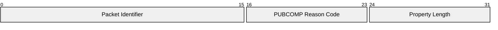

# 3.7 PUBCOMP – Publish complete (QoS 2 delivery part 3)

The PUBCOMP packet is the response to a PUBREL packet. It is the fourth and final packet of the QoS 2 protocol exchange.

## 3.7.1 PUBCOMP Fixed Header

Figure 3-16 – PUBCOMP packet Fixed Header

|         |                              |       |       |       |          |       |       |       |
| ------- | ---------------------------- | ----- | ----- | ----- | -------- | ----- | ----- | ----- |
| **Bit** | **7**                        | **6** | **5** | **4** | **3**    | **2** | **1** | **0** |
| byte 1  | MQTT Control packet type (7) |       |       |       | Reserved |       |       |       |
|         | 0                            | 1     | 1     | 1     | 0        | 0     | 0     | 0     |
| byte 2  | Remaining Length             |       |       |       |          |       |       |       |

**Remaining Length field**

This is the length of the Variable Header, encoded as a Variable Byte Integer.

## 3.7.2 PUBCOMP Variable Header

The Variable Header of the PUBCOMP Packet contains the following fields in the order: Packet Identifier from the PUBREL packet that is being acknowledged, PUBCOMP Reason Code, and Properties. The rules for encoding Properties are described in [section 2.2.2](./2.2_mqtt-control-packet-format.md#222-properties).

Figure 3-17 - PUBCOMP packet Variable Header

|         |                       |       |       |       |       |       |       |       |
| ------- | --------------------- | ----- | ----- | ----- | ----- | ----- | ----- | ----- |
| **Bit** | **7**                 | **6** | **5** | **4** | **3** | **2** | **1** | **0** |
| byte 1  | Packet Identifier MSB |       |       |       |       |       |       |       |
| byte 2  | Packet Identifier LSB |       |       |       |       |       |       |       |
| byte 3  | PUBCOMP Reason Code   |       |       |       |       |       |       |       |
| byte 4  | Property Length       |       |       |       |       |       |       |       |

### 3.7.2.1 PUBCOMP Reason Code

Byte 3 in the Variable Header is the PUBCOMP Reason Code. If the Remaining Length is 2, then the value 0x00 (Success) is used.

Table 3-7 – PUBCOMP Reason Codes

|           |         |                             |                                                                                                                                                                       |
| --------- | ------- | --------------------------- | --------------------------------------------------------------------------------------------------------------------------------------------------------------------- |
| **Value** | **Hex** | **Reason Code name**        | **Description**                                                                                                                                                       |
| 0         | 0x00    | Success                     | Packet Identifier released. Publication of QoS 2 message is complete.                                                                                                 |
| 146       | 0x92    | Packet Identifier not found | The Packet Identifier is not known. This is not an error during recovery, but at other times indicates a mismatch between the Session State on the Client and Server. |

The Client or Server sending the PUBCOMP packet MUST use one of the PUBCOMP Reason Code values [MQTT-3.7.2-1]. The Reason Code and Property Length can be omitted if the Reason Code is 0x00 (Success) and there are no Properties. In this case the PUBCOMP has a Remaining Length of 2.

### 3.7.2.2 PUBCOMP Properties

#### 3.7.2.2.1 Property Length

The length of the Properties in the PUBCOMP packet Variable Header encoded as a Variable Byte Integer. If the Remaining Length is less than 4 there is no Property Length and the value of 0 is used.

#### 3.7.2.2.2 Reason String

**31 (0x1F) Byte**, Identifier of the Reason String.

Followed by the UTF-8 Encoded String representing the reason associated with this response. This Reason String is a human readable string designed for diagnostics and SHOULD NOT be parsed by the receiver.

The sender uses this value to give additional information to the receiver. The sender MUST NOT send this Property if it would increase the size of the PUBCOMP packet beyond the Maximum Packet Size specified by the receiver [MQTT-3.7.2-2]. It is a Protocol Error to include the Reason String more than once.

#### 3.7.2.2.3 User Property

**38 (0x26) Byte,** Identifier of the User Property.

Followed by UTF-8 String Pair. This property can be used to provide additional diagnostic or other information. The sender MUST NOT send this property if it would increase the size of the PUBCOMP packet beyond the Maximum Packet Size specified by the receiver [MQTT-3.7.2-3]. The User Property is allowed to appear multiple times to represent multiple name, value pairs. The same name is allowed to appear more than once.

## 3.7.3 PUBCOMP Payload

The PUBCOMP packet has no Payload.

## 3.7.4 PUBCOMP Actions

This is described in [section 4.3.3](./4.3_quality-of-service-levels-and-protocol-flows.md#433-qos-2-exactly-once-delivery).
