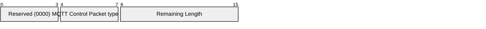

# 3.9 SUBACK – Subscribe acknowledgement

A SUBACK packet is sent by the Server to the Client to confirm receipt and processing of a SUBSCRIBE packet.

A SUBACK packet contains a list of Reason Codes, that specify the maximum QoS level that was granted or the error which was found for each Subscription that was requested by the SUBSCRIBE.

## 3.9.1 SUBACK Fixed Header

Figure 3-22 - SUBACK Packet Fixed Header

| **Bit** | **7** | **6** | **5** | **4** | **3** | **2** | **1** | **0** |
| ------- | ----- | ----- | ----- | ----- | ----- | ----- | ----- | ----- |
| byte 1  | **MQTT Control Packet type (9)** |       |       |       | **Reserved** |       |       |       |
|         | 1     | 0     | 0     | 1     | 0     | 0     | 0     | 0     |
| byte 2  | **Remaining Length** |       |       |       |       |       |       |       |

**Remaining Length field**

This is the length of Variable Header plus the length of the Payload, encoded as a Variable Byte Integer.

## 3.9.2 SUBACK Variable Header

The Variable Header of the SUBACK Packet contains the following fields in the order: the Packet Identifier from the SUBSCRIBE Packet that is being acknowledged, and Properties.

### 3.9.2.1 SUBACK Properties

#### 3.9.2.1.1 Property Length

The length of Properties in the SUBACK packet Variable Header encoded as a Variable Byte Integer

#### 3.9.2.1.2 Reason String

**31 (0x1F) Byte,** Identifier of the Reason String.

Followed by the UTF-8 Encoded String representing the reason associated with this response. This Reason String is a human readable string designed for diagnostics and SHOULD NOT be parsed by the Client.

The Server uses this value to give additional information to the Client. The Server MUST NOT send this Property if it would increase the size of the SUBACK packet beyond the Maximum Packet Size specified by the Client [MQTT-3.9.2-1]. It is a Protocol Error to include the Reason String more than once.

#### 3.9.2.1.3 User Property

**38 (0x26) Byte,** Identifier of the User Property.

Followed by UTF-8 String Pair. This property can be used to provide additional diagnostic or other information. The Server MUST NOT send this property if it would increase the size of the SUBACK packet beyond the Maximum Packet Size specified by Client [MQTT-3.9.2-2]. The User Property is allowed to appear multiple times to represent multiple name, value pairs. The same name is allowed to appear more than once.

Figure 3-23 SUBACK packet Variable Header

| **Bit** | **7** | **6** | **5** | **4** | **3** | **2** | **1** | **0** |
| ------- | --------------------- | ----- | ----- | ----- | ----- | ----- | ----- | ----- |
| byte 1  | Packet Identifier MSB |       |       |       |       |       |       |       |
| byte 2  | Packet Identifier LSB |       |       |       |       |       |       |       |

## 3.9.3 SUBACK Payload

The Payload contains a list of Reason Codes. Each Reason Code corresponds to a Topic Filter in the SUBSCRIBE packet being acknowledged. The order of Reason Codes in the SUBACK packet MUST match the order of Topic Filters in the SUBSCRIBE packet [MQTT-3.9.3-1].

Table 3-8 - Subscribe Reason Codes

| **Value** | **Hex** | **Reason Code name**                   | **Description**                                                                                                                    |
| --------- | ------- | -------------------------------------- | ---------------------------------------------------------------------------------------------------------------------------------- |
| 0         | 0x00    | Granted QoS 0                          | The subscription is accepted and the maximum QoS sent will be QoS 0. This might be a lower QoS than was requested.                 |
| 1         | 0x01    | Granted QoS 1                          | The subscription is accepted and the maximum QoS sent will be QoS 1. This might be a lower QoS than was requested.                 |
| 2         | 0x02    | Granted QoS 2                          | The subscription is accepted and any received QoS will be sent to this subscription.                                               |
| 128       | 0x80    | Unspecified error                      | The subscription is not accepted and the Server either does not wish to reveal the reason or none of the other Reason Codes apply. |
| 131       | 0x83    | Implementation specific error          | The SUBSCRIBE is valid but the Server does not accept it.                                                                          |
| 135       | 0x87    | Not authorized                         | The Client is not authorized to make this subscription.                                                                            |
| 143       | 0x8F    | Topic Filter invalid                   | The Topic Filter is correctly formed but is not allowed for this Client.                                                           |
| 145       | 0x91    | Packet Identifier in use               | The specified Packet Identifier is already in use.                                                                                 |
| 151       | 0x97    | Quota exceeded                         | An implementation or administrative imposed limit has been exceeded.                                                               |
| 158       | 0x9E    | Shared Subscriptions not supported     | The Server does not support Shared Subscriptions for this Client.                                                                  |
| 161       | 0xA1    | Subscription Identifiers not supported | The Server does not support Subscription Identifiers; the subscription is not accepted.                                            |
| 162       | 0xA2    | Wildcard Subscriptions not supported   | The Server does not support Wildcard Subscriptions; the subscription is not accepted.                                              |

The Server sending a SUBACK packet MUST use one of the Subscribe Reason Codes for each Topic Filter received [MQTT-3.9.3-2].

**Non-normative comment**

There is always one Reason Code for each Topic Filter in the corresponding SUBSCRIBE packet. If the Reason Code is not specific to a Topic Filters (such as 0x91 (Packet Identifier in use)) it is set for each Topic Filter.
