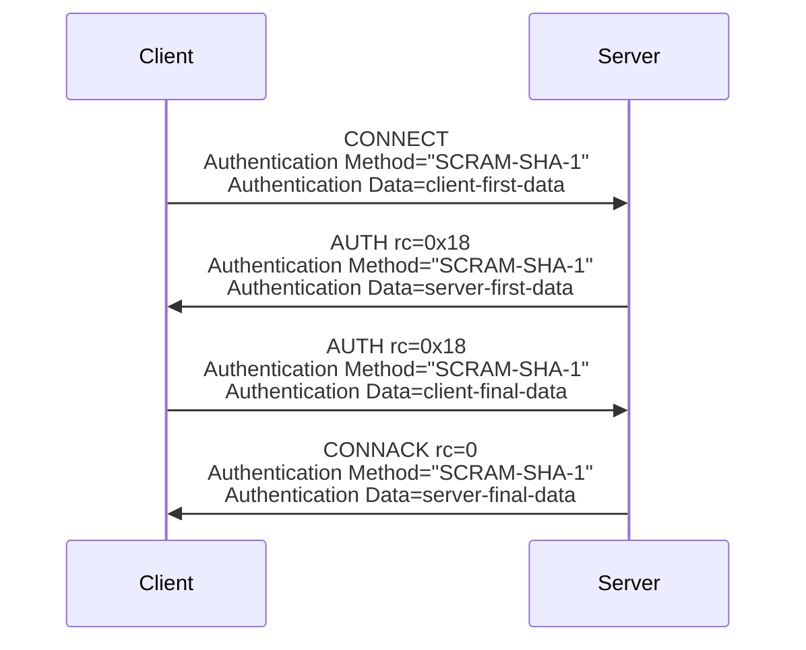
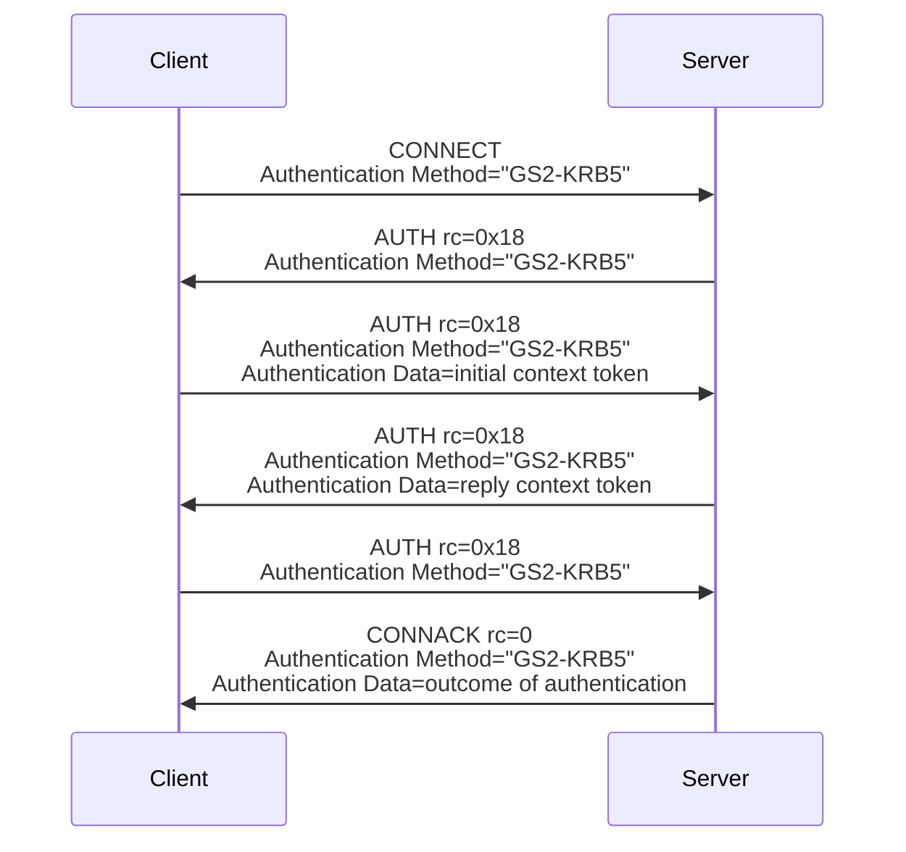

# 4.12 Enhanced authentication

The MQTT CONNECT packet supports basic authentication of a Network Connection using the User Name and Password fields. While these fields are named for a simple password authentication, they can be used to carry other forms of authentication such as passing a token as the Password.

Enhanced authentication extends this basic authentication to include challenge / response style authentication. It might involve the exchange of AUTH packets between the Client and the Server after the CONNECT and before the CONNACK packets.

To begin an enhanced authentication, the Client includes an Authentication Method in the CONNECT packet. This specifies the authentication method to use. If the Server does not support the Authentication Method supplied by the Client, it MAY send a CONNACK with a Reason Code of 0x8C (Bad authentication method) or 0x87 (Not Authorized) as described in [section 4.13](4.13_handling-errors.md) and MUST close the Network Connection [MQTT-4.12.0-1].

The Authentication Method is an agreement between the Client and Server about the meaning of the data sent in the Authentication Data and any of the other fields in CONNECT, and the exchanges and processing needed by the Client and Server to complete the authentication.

**Non-normative comment**

The Authentication Method is commonly a SASL mechanism, and using such a registered name aids interchange. However, the Authentication Method is not constrained to using registered SASL mechanisms.

If the Authentication Method selected by the Client specifies that the Client sends data first, the Client SHOULD include an Authentication Data property in the CONNECT packet. This property can be used to provide data as specified by the Authentication Method. The contents of the Authentication Data are defined by the authentication method.

If the Server requires additional information to complete the authentication, it can send an AUTH packet to the Client. This packet MUST contain a Reason Code of 0x18 (Continue authentication) [MQTT-4.12.0-2]. If the authentication method requires the Server to send authentication data to the Client, it is sent in the Authentication Data.

The Client responds to an AUTH packet from the Server by sending a further AUTH packet. This packet MUST contain a Reason Code of 0x18 (Continue authentication) [MQTT-4.12.0-3]. If the authentication method requires the Client to send authentication data for the Server, it is sent in the Authentication Data.

The Client and Server exchange AUTH packets as needed until the Server accepts the authentication by sending a CONNACK with a Reason Code of 0. If the acceptance of the authentication requires data to be sent to the Client, it is sent in the Authentication Data.

The Client can close the connection at any point in this process. It MAY send a DISCONNECT packet before doing so. The Server can reject the authentication at any point in this process. It MAY send a CONNACK with a Reason Code of 0x80 or above as described in [section 4.13](4.13_handling-errors.md), and MUST close the Network Connection [MQTT-4.12.0-4].

If the initial CONNECT packet included an Authentication Method property then all AUTH packets, and any successful CONNACK packet MUST include an Authentication Method Property with the same value as in the CONNECT packet [MQTT-4.12.0-5].

The implementation of enhanced authentication is OPTIONAL for both Clients and Servers. If the Client does not include an Authentication Method in the CONNECT, the Server MUST NOT send an AUTH packet, and it MUST NOT send an Authentication Method in the CONNACK packet [MQTT-4.12.0-6]. If the Client does not include an Authentication Method in the CONNECT, the Client MUST NOT send an AUTH packet to the Server [MQTT-4.12.0-7].

If the Client does not include an Authentication Method in the CONNECT packet, the Server SHOULD authenticate using some or all of the information in the CONNECT packet, TLS session, and Network Connection.

**Non-normative example showing a SCRAM challenge**

**Non-normative example showing a Kerberos challenge**

## 4.12.1 Re-authentication

If the Client supplied an Authentication Method in the CONNECT packet it can initiate a re-authentication at any time after receiving a CONNACK. It does this by sending an AUTH packet with a Reason Code of 0x19 (Re-authentication). The Client MUST set the Authentication Method to the same value as the Authentication Method originally used to authenticate the Network Connection [MQTT-4.12.1-1]. If the authentication method requires Client data first, this AUTH packet contains the first piece of authentication data as the Authentication Data.

The Server responds to this re-authentication request by sending an AUTH packet to the Client with a Reason Code of 0x00 (Success) to indicate that the re-authentication is complete, or a Reason Code of 0x18 (Continue authentication) to indicate that more authentication data is needed. The Client can respond with additional authentication data by sending an AUTH packet with a Reason Code of 0x18 (Continue authentication). This flow continues as with the original authentication until the re-authentication is complete or the re-authentication fails.

If the re-authentication fails, the Client or Server SHOULD send DISCONNECT with an appropriate Reason Code as described in [section 4.13](4.13_handling-errors.md), and MUST close the Network Connection [MQTT-4.12.1-2].

During this re-authentication sequence, the flow of other packets between the Client and Server can continue using the previous authentication.

**Non-normative comment**

The Server might limit the scope of the changes the Client can attempt in a re-authentication by rejecting the re-authentication. For instance, if the Server does not allow the User Name to be changed it can fail any re-authentication attempt which changes the User Name.
